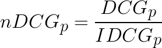
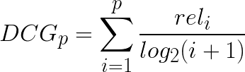
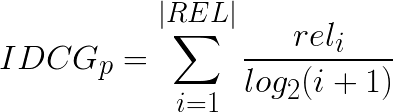

# 2018-104Hackathon-Recommendation

104 為國內最大工作媒合平台，求職媒合一直是 104 的服務核心!
請參賽者利用求職者的搜尋條件、點擊紀錄、工作內容，預測求職者點擊哪個工作的機會最高。

## 活動網址
https://www.104.com.tw/2018hackathon/

## 主題說明
比賽當天，將備有 Testing Data，讓參賽隊伍能夠藉由從 Training Data 來預測求職者在搜尋條件下將點擊哪個工作，產生一個最佳的列表排序，主辦單位將會透過計分綱址來告知參賽者推薦排序結果之分數(Normalized Discounted Cumulative Gain)，作為評分標準。

## 資料集說明
* 104求職者去識別化行為記錄
    + File: user_log.json
    + Description：求職者在104網站上瀏覽應徵職務時的行為log
    + Date: 2018-05
    + [User Log Schema](data-schema/user_log_schema.md)
    + [User Log Sample](sample-data/user_log_sample.json)
    + 實際資料集將另行公佈
* 公司與職務資料
    + 企業基本資料
        - File: companies.json
        - Decription: 資料集中所使用的公司資料
        - [Company Schema](data-schema/companies_schema.md)
        - [Company Sample](sample-data/companies_sample.json)
        - 實際資料集將另行公佈
    + 職務資料
        - File: job_info.json
        - Description: 每一筆職務的欄位資料與該職務的文字描述
        - [Job Info Schema](data-schema/job_info_schema.md)
        - [Job Info Sample](sample-data/job_info_sample.json)
        - 實際資料集將另行公佈
    + 類目資料
        - File:
            - 科系類目: department.csv [Sample](sample-data/department_sample.csv)
            - 地區類目: district.csv [Sample](sample-data/district_sample.csv)
            - 產業類目: industry.csv [Sample](sample-data/industry_sample.csv)
            - 職務類目: job_category.csv [Sample](sample-data/job_category_sample.csv)
        - Description: 在職務結構化欄位中的類目對照
        - 實際資料集將另行公佈

## 規則說明與範例
* 比賽當天，Recommendation的參賽者將會另外拿到testset-clicklog和testset-joblist，其中testset-clicklog新增id欄位方便辨識，並移除clicklist欄位，testset-joblist的schema與train-joblist相同。參賽者可使用traini    ng-set訓練出的排序模型，預測user的點擊行為(clickJob, clickSave, clickApply皆視為點擊)，並將點擊率愈高的job排序在愈前面。
    + 參賽者會拿到的上傳範例如下：
    ```
    {"id": 1, "joblist": ["10000123", "60000456", ...], "querystring": "ro=0&keyword=%E5%80%89%E5%BA%A..."}
    {"id": 2, "joblist": ["19000611", "21700145", ...], "querystring": "ro=0&keyword=%E6%B3%95%E5%8B%9..."}
    ...
    ```
    + 預測結果後於joblist欄位填入重新排序結果再上傳，每一隊當天有 __十次__ 的上傳次數限制，上傳後可以得到該次上傳的分數，若排名進前七名則會顯示在Leader Board上。
    ```
    {"id": 1, "joblist": ["60000456", "10000123", ...]}
    {"id": 2, "joblist": ["21700145", "19000611", ...]}
    ...
    ```

* 相關資訊連結
    + Testing set：比賽前一天以Email通知參賽者下載連結
    + 上傳範例：比賽前一天以Email通知參賽者下載連結
    + Leader Board及上傳網址：https://hackathon2018.events.104.com.tw

## 評分標準
* 推薦結果 70%
    + Metrics: Normalized discounted cumulative gain (NDCG) [Wiki](https://en.wikipedia.org/wiki/Discounted_cumulative_gain)
        - 此次競賽我們使用 NDCG 作為評價結果的指標，因此將預測會被點擊的工作排在list的愈前端，可以得到愈高的分數，公式參考Wiki的定義如下:

          

          

          

* 設計方法 30%（包含簡報內容、演算法設計、資料闡釋與分析等）

## 104開放資料授權條款
【2018-104-hackathon-dataset】是 2018年104資訊科技Hackathon活動中開放的資料集。當您使用104提供之【2018-104-hackathon-dataset】資料集時，即表示您已閱讀、瞭解並同意接受本授權條款所訂定之所有內容。本授權條款得隨時修訂並公告於本頁面上，修訂後之內容自公告時起生效，授權說明如下：

* 使用者權利：
    + 使用者得自由應用104提供的資料集，產生新的程式、文件、圖表等著作，使用者亦可自由修改104提供的資料集，衍生新的資料集，使用者基於本活動目的範圍的任何使用方式，無須104再為授權。
* 使用者義務：
    + 使用者必須在您的著作或衍生資料集明確標示【2018年104資訊科技Hackathon】為資料來源，與此份說明文件的連結。
    + 使用者違反前項標示義務，視為自始未取得104開放資料之授權，須負擔所有相關之法律責任。
* 使用者規範：
    1. 使用者不可使用可能造成104會員混淆或困擾的商標或名稱，或為任何違反104會員服務條款或本活動授權規範之行為。
    2. 使用者不可違反中華民國法令，或造成第三人發生違反中華民國法令的行為。
    3. 使用者保證不可另為提供他人資料集下載，意即，使用者不得複製一份資料集到您自己的網路服務上供他人下載，但您可以提供他人此份說明文件的連結。使用者同意且了解，若您利用104提供的資料集，開發任何妨礙善良風俗之違法服務或程式工具，104並不為此負擔任何法律連帶責任。
    4. 使用者不得意圖或為任何可能損害104商譽或侵害104資料之任何行為或聲明。
    5. 謝絕競業使用，作任何商業營利或非商業研究分析之用。
    6. 本條款之解釋、效力、履行及其他未盡事宜，以中華民國法律為準據法。
